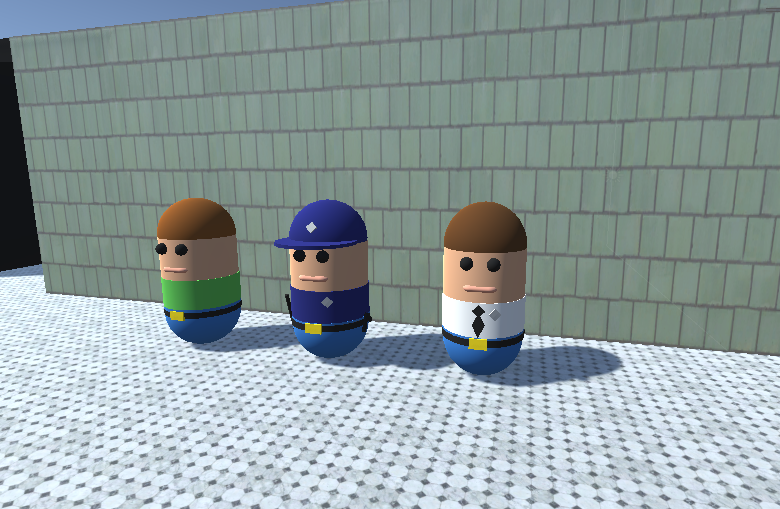
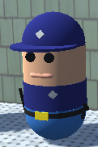

# Goal Oriented Action Planning

Goal-Oriented Action Planning is an Artificial Intelligence technique where agents (actors that are placed in the scene and act autonomously) plan actions to perform given some goals they have. They are prepared with a set of actions that have some preconditions and postconditions that help them fulfill subgoals. In this project proposed in the subject Artificial Intelligence for Video Games from the Master's Degree in Game Development at Universidad de La Laguna, we simulated, by using G.O.A.P., a police station where civilians go and get their ID cards renewed.

## Agents

We used three types of agents: civilians, who get their ID cards renewed; guards, who frisk civilians and let them in; and attendants, who take care of civilians' requests.

### Civilians

Civilians have three goals: to get ready to be frisked by a guard, to go to a table and get attended by an attendant and to go home.

Civilians have five actions that help them fulfill their goals:

 - Go To Door: civilians go to the station door.
 - Get Frisked: civilians enter the station and wait for a guard to frisk them. This action fulfills their first goal. This action triggers the action Frisk from the Guard, at the end of which civilians will be able to perform the next action.
 - Go To Waiting Area: once they have been frisked by a guard, they will be able to enter the station's waiting area.
 - Get Dni Renewed: if there is any available, civilians go to a desk and request the attendant there to renew their ID card. This action fulfills their second goal.
 - Go Home: once they have been delivered their renewed ID card by the attendant, they can go home. This action fulfills their last goal.

### Guards

Guards have two goals: to be rested and to frisk civilians.

Guards have two actions that help them fulfill their goals:

 - Rest: if there is no civilians waiting to get frisked, guards just go to a corner and rest. This action fulfills their first goal.
 - Frisk: if there is a civilian waiting to get frisked, guards go and frisk them. This action fulfills their second goal.

### Attendants

Attendants have two goals: to be attending at a table and to renew civilians' ID cards.

Attendants have three actions that help them fulfill their goals:

 - Attend Table: if, for any reason, they were not before, they go to a table and start attending civilians. This action fulfills their first goal.
 - Go To Copier: when a civilian requests an attendant a new ID card, that attendant goes to a copy machine, if there is any available, and waits for that new ID card to be printed.
 - Deliver Dni: after the ID card has been printed, attendants go back to their table and deliver the civilian who is waiting their new ID card. This action fulfills their second goal.

## Demo

https://user-images.githubusercontent.com/115027100/214361282-5c17ca03-a2ac-4664-86ba-391ac9b404d0.mp4

## Asset References

 - Low Poly Office Copy Machine: https://sketchfab.com/3d-models/low-poly-office-copy-machine-f6d56154ad87402e899f8a2df4b114d9
